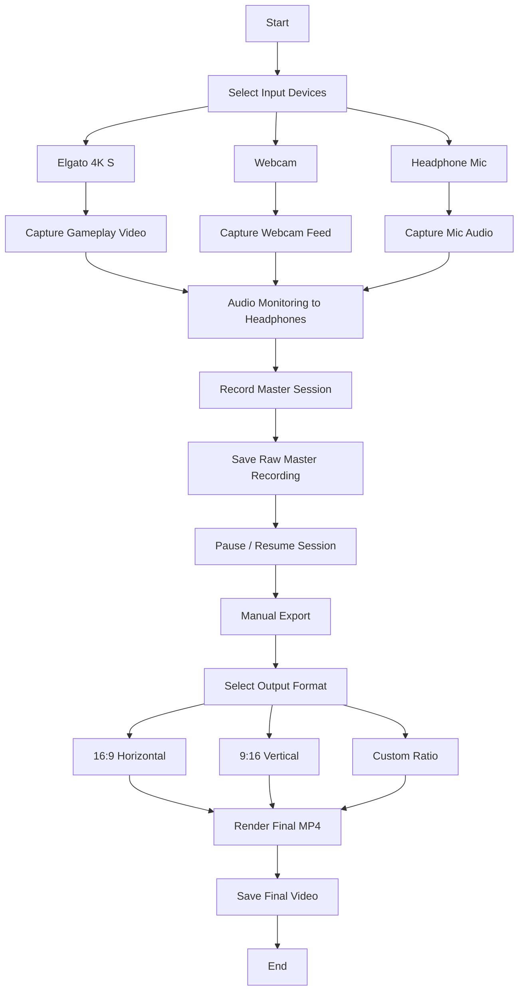

```mermaid
flowchart TD
    A[Start] --> B[Select Input Devices]
    B --> C[Elgato 4K S]
    B --> D[Webcam]
    B --> E[Headphone Mic]

    C --> F[Capture Gameplay Video]
    D --> G[Capture Webcam Feed]
    E --> H[Capture Mic Audio]

    F --> I[Audio Monitoring to Headphones]
    G --> I
    H --> I

    I --> J[Record Master Session]
    J --> K[Save Raw Master Recording]
    K --> L[Pause / Resume Session]
    L --> M[Manual Export]

    M --> N[Select Output Format]
    N --> O[16:9 Horizontal]
    N --> P[9:16 Vertical]
    N --> Q[Custom Ratio]

    O --> R[Render Final MP4]
    P --> R
    Q --> R
    R --> S[Save Final Video]
    S --> T[End]
```
